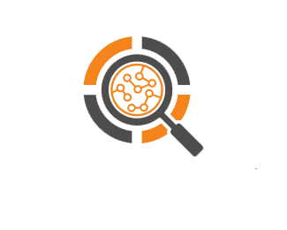
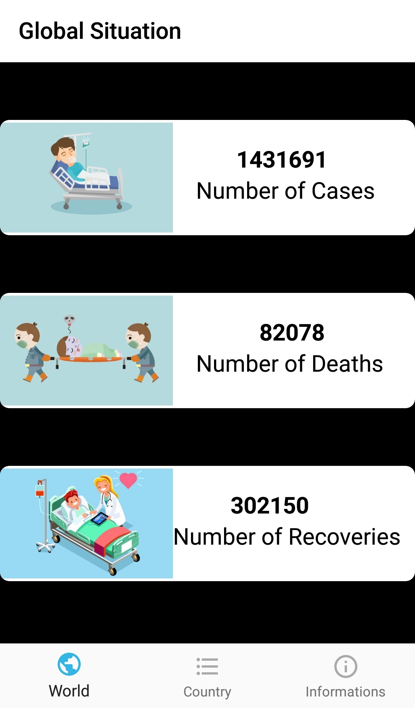
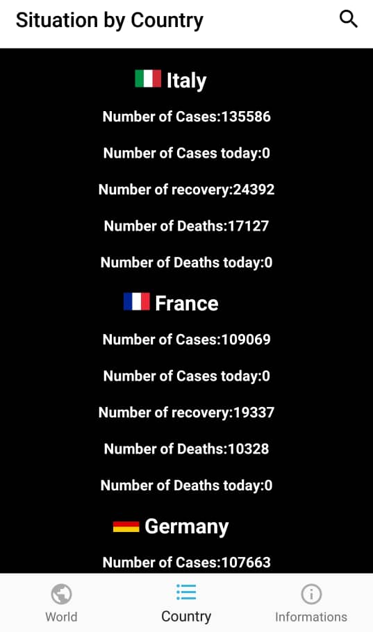
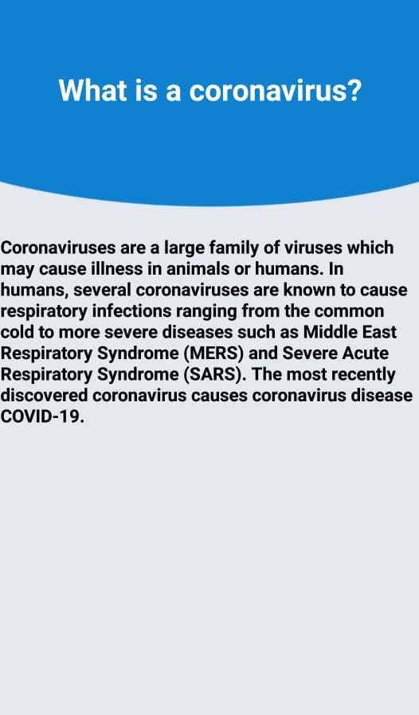

# CoVid19-Tracker

Covid19-Tracker  is a sample Android application 📱 built to demonstrate use of Modern Android development tools.

| Main Screen (Global numbers)      |  Country tab |  Information tab |
| ----------- | ----------- |----------- |
||||

## About

- Loads Total Covid-19 cases in the world from API
- User can search for a particular country 
- Numbers are updated automatically
- Information provided by WHO

## Built With 🛠

- Java
- Android Architecture Components - Collection of libraries that help you design robust, testable, and maintainable apps.
    - LiveData - Data objects that notify views when the underlying database changes.
    - ViewModel - Stores UI-related data that isn't destroyed on UI changes.
- Retrofit - A type-safe HTTP client for Android and Java.
- Room - A persistence library provides an abstraction layer over SQLite

## Credits

Thanks to [NovelCovid](https://github.com/NovelCOVID/API) for the API

## Licence

MIT License

Copyright (c) 2020 Rachid Insa

Permission is hereby granted, free of charge, to any person obtaining a copy
of this software and associated documentation files (the "Software"), to deal
in the Software without restriction, including without limitation the rights
to use, copy, modify, merge, publish, distribute, sublicense, and/or sell
copies of the Software, and to permit persons to whom the Software is
furnished to do so, subject to the following conditions:

The above copyright notice and this permission notice shall be included in all
copies or substantial portions of the Software.

THE SOFTWARE IS PROVIDED "AS IS", WITHOUT WARRANTY OF ANY KIND, EXPRESS OR
IMPLIED, INCLUDING BUT NOT LIMITED TO THE WARRANTIES OF MERCHANTABILITY,
FITNESS FOR A PARTICULAR PURPOSE AND NONINFRINGEMENT. IN NO EVENT SHALL THE
AUTHORS OR COPYRIGHT HOLDERS BE LIABLE FOR ANY CLAIM, DAMAGES OR OTHER
LIABILITY, WHETHER IN AN ACTION OF CONTRACT, TORT OR OTHERWISE, ARISING FROM,
OUT OF OR IN CONNECTION WITH THE SOFTWARE OR THE USE OR OTHER DEALINGS IN THE
SOFTWARE.
